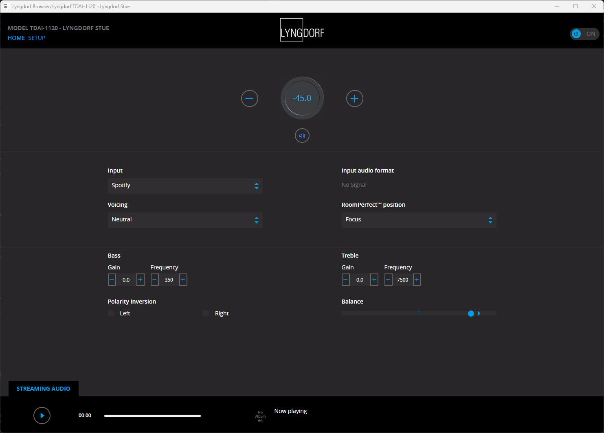
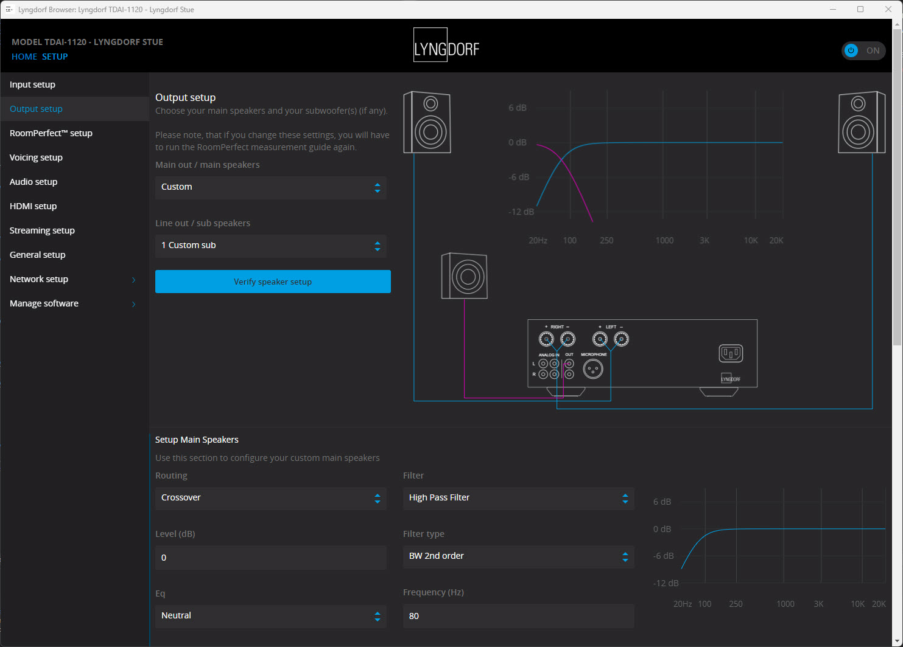

# Lyngdorf Browser

  
  
  

## Download

[Download the latest version](../../releases/latest)

[Version History](CHANGELOG.md)

# Requrements
Visual C++ Redistributable for Visual Studio 2015-2022 x64 (embedded in installer, but need to be installed for CefSharp)

.NET Framework 4.8

# Introduction 
Welcome to the Lyngdorf Amplifier Finder!

This project provides a small browser that enables you to find Lyngdorf amplifiers on your local network. The browser is built using C# WinForms and uses networking and web technologies to scan your network and identify any Lyngdorf amplifier web applications that may be running on your network.

To get started, simply start the application and the browser will scan your local network for any Lyngdorf amplifier web applications and display them in the browser window. If a Lyngdorf amplifier is found, it will show up in the application!

Happy listning! 🔈

# How the code is working
This code attempts to find the IP address of a Lyngdorf device on the local network using its MAC address. The MAC address is a unique identifier assigned to network interfaces, and it can be used to identify devices on the network.

The MainForm_Load method checks if any command-line argument has been passed and, if so, tries to initialize the ChromiumWebBrowser with the specified IP address. If the IP address is not valid, it displays an error message and exits the application. If no argument is set, it initializes the browser by searching for the device on the network using the InitializeChromium method.

The code first calls the FindIpFromMacAddress method of the IpMacMapper class, passing the MAC address of the Lyngdorf device as a parameter. This method returns the IP address associated with the specified MAC address, if any.

If an IP address is found, the code creates a new instance of the ChromiumWebBrowser class, passing the IP address as the URL to display. This creates a new browser window in the application that displays the web interface of the Lyngdorf device.

If no IP address is found, the code displays a message box indicating that no Lyngdorf devices were found on the network. If an error occurs during the IP address lookup, the code displays a message box indicating that the operation failed and the device may not be supported.

The code also sets up an event handler for the TitleChanged event of the ChromiumWebBrowser control. This event is triggered when the title of the browser window changes, which can happen when the user navigates to a different page or performs an action in the Lyngdorf web interface. The event handler updates the title of the main application window to reflect the title of the browser window, providing a more seamless browsing experience for the user.

# The application when running and found an Lyngdorf amplifier:

**Homepage:**

**Settings:**

To set the IP address for the device to connect to manuel if you need to connect to a specific:

`.\LyngdorfBrowser.exe 192.168.1.200`

## How to build

- Get [Visual Studio 2022](https://visualstudio.microsoft.com/vs/community/) (Community Edition is fine)
- Install ".NET desktop development" workload  
  
- Remember to select: Install .NET Framework 4.8 SDK
- Build the solution in Visual Studio

# Sponsors
## Advanced Installer
The installer is created from a Free Advanced Installer License for Open-Source from <a href="https://www.advancedinstaller.com/" target="_blank">https://www.advancedinstaller.com/</a> - check it out!

